# Arduino Sensors UDP Gateway
Arduino-based sensor gateway gateway with web interface. Collects data data from sensors (see bellow for supported sensor types) and sends them as a JSON-formated UDP message.

* [What is it good for?](#what-is-it-good-for)
* [Core features](#core-features)
  - [Flexible and Scalable](#flexible-and-scalable)
  - [Automatic Sensor Detection](#automatic-sensor-detection)
  - [Easy Configuration via WebUI](#easy-configuration-via-webui)
  - [Reliable Data Collection](#reliable-data-collection)
  - [Human-Readable UDP Output](#human-readable-udp-output)
* [Hardware](#hardware)
* [Firmware](#firmware)
* [Common Settings](#common-settings)
  - [System Info](#system-info)
  - [Sensor Status](#sensor-status)
  - [IP Settings](#ip-settings)
  - [TCP/UDP Settings](#tcpudp-settings)
  - [Tools](#tools)
* [DS18x20 Sensors (1-Wire)](#ds18x20-sensors-1-wire)
  - [Hardware](#hardware-1)
  - [DS18x20 Settings](#ds18x20-settings)
* [BH1750 Sensors (I2C)](#integration)
  - [Hardware](#hardware-2)
  - [BH1750 Settings](#bh1750-settings)
* [MAX31865 Sensors (SPI)](#max31865-sensors-spi)
  - [Hardware](#hardware-3)
  - [MAX31865 Settings](#max31865-settings)
* [Integration](#integration)
  - [Loxone](#loxone)
  - [Node-RED](#node-red)

# What is it good for?

Allows you to build a cheap but reliable gateway for collecting sensor data for further processing by home automation system. The gateway was primarily designed for easy and user-friendly integration of various sensors into Loxone home automation system, but can be used for any other system capable of processing JSON-formated UDP messages.

# Core features

## Flexible and Scalable

Before compiling the firmware, you have to decide which **types of sensors** you want to connect to the gateway. In other words, you have to choose whether you want to build a "1-Wire Temperature + MAX31865 RTD Temperature Sensors Gateway" or a "BH1750 Light Sensors Gateway". You can select 2-3 different sensor types before compiling the firmware.

Once you have your gateway up and running, you can connect **additional sensors** (of the same type). Without the need to compile and upload new firmware to your Arduino! The advantage of Arduino (over ESP32) is a large number of pins. You can connect additional sensors (of the same type) as long as you have pins available.

## Automatic Sensor Detection

The gateway automatically **detects new sensors** connected to your Arduino pins (if support for this particular sensor was selected during compile time). Once detected, the sensor is stored in Arduino EEPROM, listed on the Sensor Status page and measurement data are sent via UDP. In case the sensor disconnects later on, error is shown in the web interface. It is recommended to connect sensors when the gateway is powered off, but the gateway can also detect new sensor when operating (the gateway scans available pins at a 5 sec interval).

## Easy Configuration via WebUI

The built-in **web interface** allows you to check the status of sensors connected to your Arduino and change settings of your Arduino. In particular, you can change network settings and change how often you want to collect data from your sensors. You do not need to compile and upload new firmware to your Arduino! Your settings are automatically **stored in Arduino's EEPROM** and loaded after restart.

## Reliable Data Collection

The gateway was designed for home automatization. It sits in your electrical distribution enclosure, connected to multiple sensors distributed throughout your house. The gateway employs [**automatic repeat request**](https://en.wikipedia.org/wiki/Automatic_repeat_request) as an effective error-control method. The gateway polls sensors at specified intervals (configurable via WebUI). If the sensor fails to respond (or responds with invalid data or an error), the gateway will immediatelly sends a repeated request (up to 10 repeated requests are sent in quick succession). This simple yet effective error-control method allows us to reliably collect sensor data over an unreliable communication channel. The gateway reliably collects data from 1-wire sensors and even I2C sensors connected over long distances!

## Human-Readable UDP Output

The gateway regularly polls sensors and sends **UDP messages** at specified reporting intervals. The UDP messages are formated in human-readable **JSON format**. JSON-formated UDP messages can be easily parsed by Loxone miniserver and other systems (incl. Node-RED). Other protocols (such as MQTT) are not supported due to limited resources on Arduino.

Sample JSON output:
`{"Sensor":"DS18x20","PinType":"1WIRE","Pin":"3","1WireID":"28FFE5A479180142","Value":"22.437","Unit":"°C","Status":"OK"}`

# Hardware

The gateway was designed for a particular combination of MCU (Arduino) and ethernet chips (Wiznet). Connect connect these core components:

* **Arduino Nano, Uno or Mega** (and possibly other boards with ATmega chips).  This gateway was tailor-made for ATmega chips which have relatively low resources (flash and RAM).  ATTENTION: Other MCUs are not supported (and will not be supported). If you have more powerful chips (ESP32), go for universal, generic firmwares (such as [ESPEasy](https://www.letscontrolit.com/wiki/index.php/Main_Page), [ESPHome](https://esphome.io/)).
* **Ethernet shield with WIZnet chip (W5100, W5200 or W5500)**. The ubiquitous W5100 shield for Uno/Mega is sufficient. If available, I recommend W5500 Ethernet Shield. You can also use combo board MCU + ethernet (such as ATmega328 + W5500 board from Keyestudio). ATTENTION: Ethernet shields with ENC28J60 chip will not work !!!
* **External power supply**. All sensors supported by the gateway are powered by 5V. Use regulated 5V external power supply for both the Arduino (+ the ethernet shield) and your sensors. ATTENTION: By using the 5V pin, you are bypassing Arduino's built-in voltage regulator and reverse-polarity protection curcuit. Make sure your external power supply does not exceed 5,5V !!!
* **DIN Rail Terminal Block For Arduino**. If you want to place your gateway in your electrical distribution enclosure, get yourself a DIN rail terminal block for Arduino. Standard UTP cables are sufficient for wiring your sensors to the gateway.

I highly recommend using combo board (ATmega328 + W5500 on one board) or a pin-compatible Arduino Ethernet Shield. If you use non-standard ethernet board, you need to connect it manually:

**Ethernet Shield Wiring**:

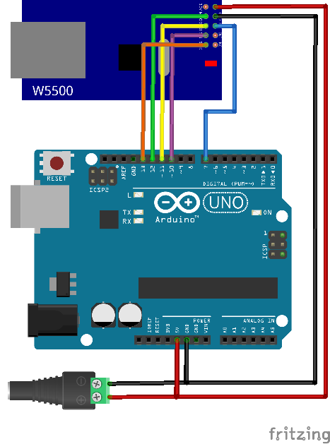

VCC <-> 5V 
GND <-> GND 
RST <-> 7 
CS <-> 10 
MOSI <-> 11 
MISO <-> 12 
SCK <-> 13 

* The ethernet shield uses the SPI bus (11, 12, 13 on Arduino Uno / Nano). Pin 10 is the ethernet shield's unique chip select.
* We also use pin 7 for reseting the ethernet shield (HW modification of the shield is needed for this to work).
* The SPI bus (pins 11, 12, 13) is shared with SPI sensors.

# Firmware

1. Download this repository (all *.ino files) and open arduino-sensors-udp-gateway.ino in Arduino IDE.
2. Pre-compile configuration in advanced_settings.h:
  * Enable support for selected sensors types (ENABLE_DS18X20, ENABLE_BH1750, etc.)
  * If you only have 1 sensor type enabled, feel free to enable extended Web UI (ENABLE_EXTENDED_WEBUI).
  * Optionally, you can adjust default factory settings (setttings with DEFAULT in their name can be later changed via web interface) or change advanced settings (can only be changed before compilation).
3. Download all required libraries. The program uses the following external libraries (both are available in Arduino IDE's "library manager"):
 - StreamLib (https://github.com/jandrassy/StreamLib)
 - OneWireNg (https://github.com/pstolarz/OneWireNg)
 - libraries used by individual sensors (see advanced_settings.h)
4. Compile and upload your program to Arduino.
5. Connect your Arduino to ethernet and use your web browser to access the web interface on default IP:  http://192.168.1.254
6. Connect your sensors.
7. Enjoy :-)
8. Connect even more sensors!

# Common Settings
  - settings marked \* are only available if ENABLE_DHCP is defined in advanced_settings.h
  - settings marked \*\* are only available if ENABLE_EXTENDED_WEBUI is defined in advanced_settings.h

## System Info
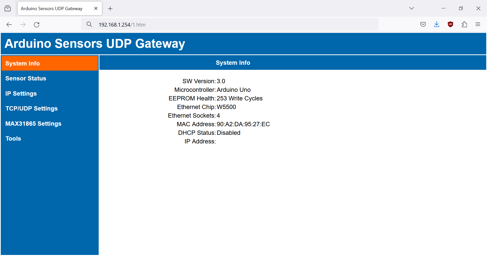

**EEPROM Health**. Keeps track of EEPROM write cycles (this counter is persistent, never cleared during factory resets). Replace your Arduino once you reach 100 000 write cycles (with 6 hours EEPROM_INTERVAL you have more than 50 years lifespan).

**Ethernet Sockets**. Max number of usable sockets. See Limitations bellow. One socket is reserved for Modbus UDP, remaining sockets are shared between Modbus TCP and WebUI.

**Ethernet Chip**. Wiznet chip on the ethernet shield.

**MAC Address**. First 3 bytes are fixed 90:A2:DA, remaining 3 bytes are random. You can also set manual MAC in IP Settings.

## Sensor Status
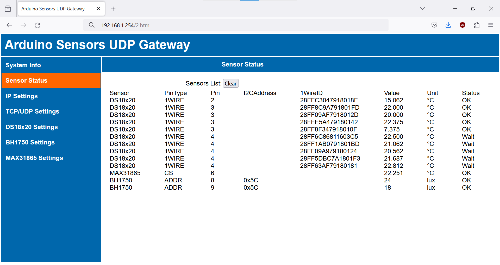

**Clear**. Clears the list of sensors on the **Sensor Status** page. The list of sensors is stored in Arduino's EEPROM, so use the **Clear** button sparingly in order to prevent EEPROM wear. Connected sensors are detected and added to the list automatically.

**Sensors List**. List of sensors detected by the gateway. Each sensor is represented by a single line in the list. Columns may vary depending on sensor types enabled during compile. Column labels and values displayed on the Sensor Status page correspond to **JSON keys and values** sent via UDP message. The Sensors List is **refreshed every 2 seconds** (through Javascript in the background). Therefore, changes in measurement values or sensor status do not show up immediatelly but with a delay.

* **Sensor**. Type of sensor.
* **PinType**. Type of pin used to identify the sensor:
  - **1WIRE**. 1-wire bus pin. Can be shared by multiple 1-wire sensors (DS18x20).
  - **CS**. Chip select pin used by SPI sensors. Unique per sensor.
  - **ADDR**. Address pin used by some I2C sensors (BH1750). Unique per sensor.
* **Pin**. Arduino pin which is used to identify the sensor.
* **I2CAddress**. I2C (TWI) address of I2C sensors.
* **1WireID**. Unique ID that identifies the sensor on the 1-wire bus.
* **Value**. Latest measurement value reported by the sensor.
* **Unit**. Unit of measurement.
* **Status**. Connection status of the sensor:
  - **OK**. The sensor responded to a request sent by the gateway. UDP message was sent at the specified reporting interval.
  - **OKish**. Recoverable communication error. Communication error has occured between the gateway and the sensor, but the sensor successfully responded to an immediate repeated request. UDP message was sent at the specified reporting interval.
  - **Wait**. The gateway is waiting for a response from the sensor. Response time (and response timeout) depends on the sensor type. For example, temperature conversion on 1-wire temperature sensors can take up to 750ms. Sensors are polled asynchronously. The code is non-blocking and timeouts do not block other functions of the gateway.
  - **Error**. The sensor failed to respond to 10 repeated requests in a row (see MAX_ATTEMPTS in advanced_settings.h). Possible causes are 1) serious communication issues between the gateway and the sensor (faulty wires) or 2) faulty sensor. If an error occurs, no UDP message is sent (use timeout in Loxone to detect errors). In case you have permanently disconnected the sensor, use **Clear** button to remove the sensor(s) from the sensor list.

## IP Settings
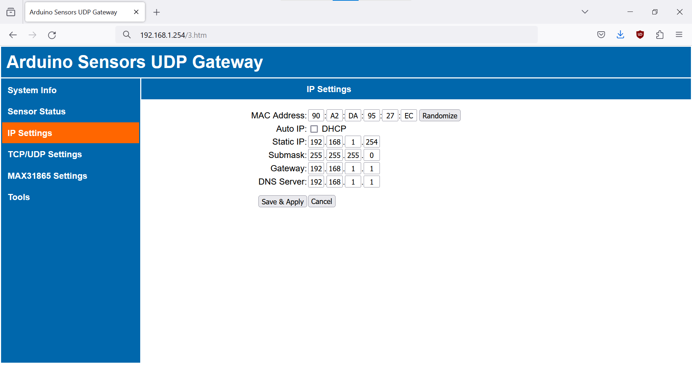

**MAC Address**.\*\* Change MAC address. **Randomize** button will generate new random MAC (first 3 bytes fixed 90:A2:DA, last 3 bytes will be random).

**Auto IP**.\* Once enabled, Arduino will receive IP, gateway, subnet and DNS from the DHCP server.

**Static IP**. Set new static IP address. Gateway automatically redirect the web interface to the new IP.

**Submask**.

**Gateway**.

**DNS**.\*

## TCP/UDP Settings
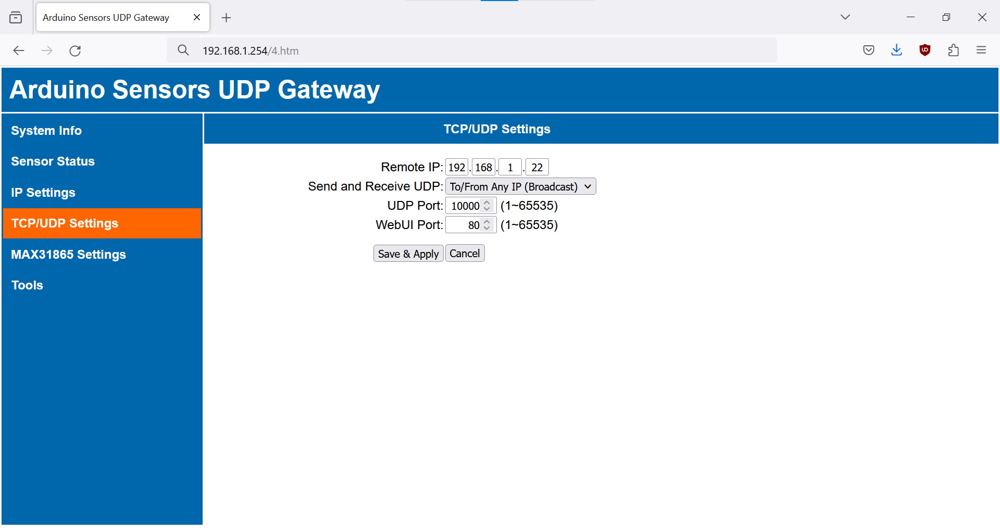

**Remote IP**.\*\* IP address of your home automation system which listens for UDP messages and sends UDP commands.

**Send and Receive UDP**.\*\*
* **Only to/from Remote IP**. Only accept UDP messages from the **Remote IP**, send UDP messages directly (unicast) to the **Remote IP**.
* **To/From Any IP (Broadcast)**. Accept UDP messages from any IP, send UDP messages as UDP broadcast. UDP broadcast is faster than UDP unicast. **Remote IP** setting has no effect.

**UDP Port**. Local UDP port and remote UDP port.

**WebUI Port**. Change web UI port, automatically redirects the web interface to the new Web UI port.

## Tools
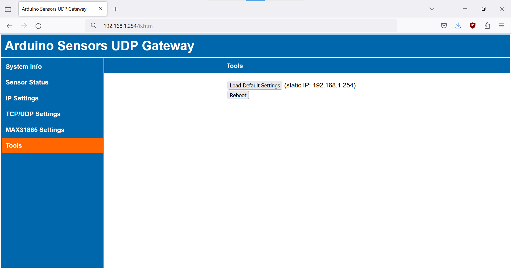

**Load Default Settings**. Loads default settings (see DEFAULT_CONFIG in advanced settings). MAC address is retained.

**Reboot**.

# DS18x20 Sensors (1-Wire)

## Hardware

**Supported Sensors**:
* DS18B20
* DS18S20
* DS1822
* DS1825
* DS28EA00

**Limitations**:
* Parasite powering is not supported.

**Wiring**:

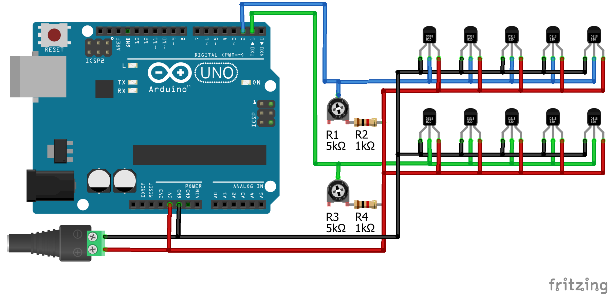

VCC <-> 5V
GND <-> GND
DATA <-> Any available pin

* Available pin (Uno / Nano) = any **digital** or **analog** pin except:
  -  7, 10 (reserved for ethernet RST and CS)
  -  11, 12, 13 (reserved for the SPI bus)
  -  A4, A5 (if you enable I2C sensors, these pins will be reserved for the I2C bus)
  -  A6, A7 (on Nano, these are exclusively analog pins)
* Multiple sensors can share the same 1-wire bus (10 and probably even more sensors can be connected to the same pin)
* According to specs, 4k7 Ohm pullup resistor is required between 1-wire bus and Vcc. In practice, weaker resistor often works better so I recommend 5k potentiometer + 1k resistor. Adjust the potentiometer until all sensors connected to the bus are detected.
* Due to limited RAM on Arduino, the total number of DS18x20 sensors on all buses is capped at 30 (see OW_MAX_SENSORS in advanced_settings.h).
* Individual sensors can be identified by unique 64-bit **1WireID** (displayed on Sensor Status page and send in the JSON-formatted UDP message).

## DS18x20 Settings

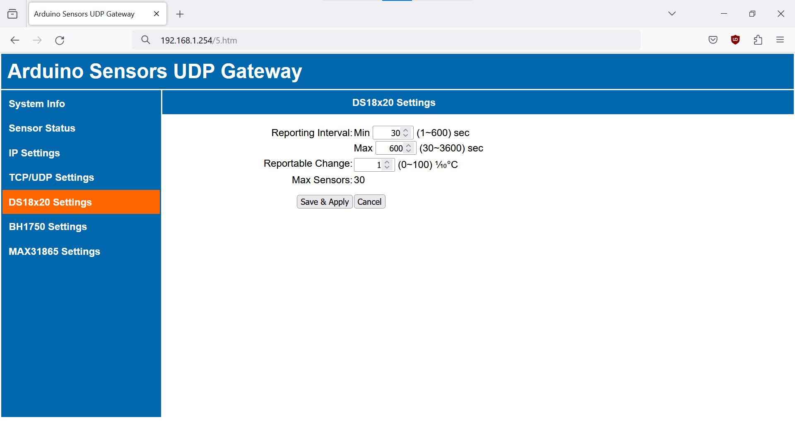

* **Min Reporting Interval**. Minimum interval (in seconds) between two UDP messages with new measurement values. This is the interval at which the gateway polls the DS18x20 sensors (sensors on the same 1-wire bus are polled at the same time). Min Reporting Interval ensures that the sensor is not polled too often and that the UDP message is not sent too often if the temperature flutters between two values.
* **Max Reporting Interval**. Maximum interval (in seconds) between two UDP messages with measurement values. Max Reporting Interval ensures that the UDP message is always sent, even if change to the measurement value is smaller than the Reportable Change.
* **Reportable Change**. Minimum change (in tenths of degrees Celsius) to the measurement value that will result in a UDP message being sent.
* **Max Sensors**. Total number of DS18x20 sensors on all buses (see OW_MAX_SENSORS in advanced_settings.h).

# BH1750 Sensors (I2C)

## Hardware

**Supported Sensors**:
* BH1750
* BH1750FVI

**Limitations**:
* Only continuous measurement mode is supported.

**Wiring**:

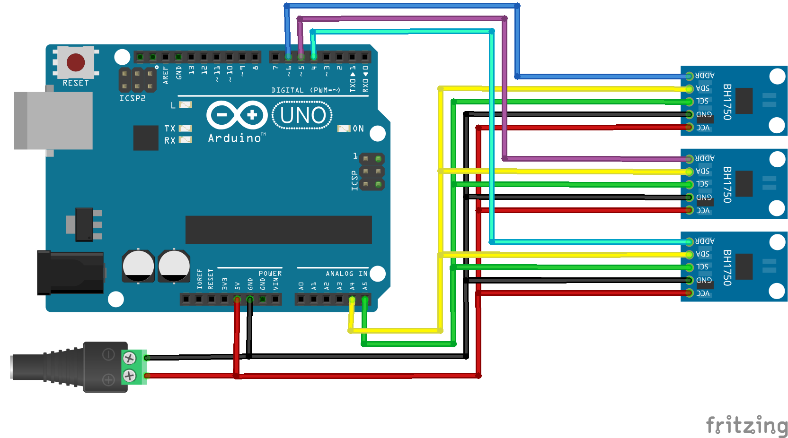

VCC <-> 5V
GND <-> GND
SDA <-> A4
SCL <-> A5
ADDR <-> Any available pin

* Available pin (Uno / Nano) = any **digital** or **analog** pin except:
  -  7, 10 (reserved for ethernet RST and CS)
  -  11, 12, 13 (reserved for the SPI bus)
  -  A4, A5 (reserved for the I2C bus)
  -  A6, A7 (on Nano, these are exclusively analog pins)
* Multiple sensors share the I2C bus and even the I2C address.
* Each sensor is connected to unique ADDR pin. BH1750 sensors communicate via I2C bus only if their ADDR pin is high (the ADDR pin plays the same role as the CS pin on the SPI bus).
* In theory, the number of BH1750 sensors is limited only by the number of available pins. In practice, you may also be limited  by capacitive loading or reflections on the I2C bus.

## BH1750 Settings

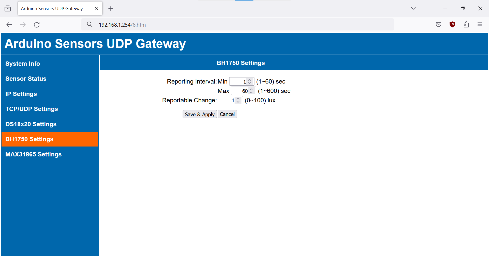

* **Min Reporting Interval**. Minimum interval (in seconds) between two UDP messages with new measurement values. This is the interval at which the gateway polls the BH1750 sensors. Min Reporting Interval ensures that the sensor is not polled too often and that the UDP message is not sent too often if the light level flutters between two values.
* **Max Reporting Interval**. Maximum interval (in seconds) between two UDP messages with measurement values. Max Reporting Interval ensures that the UDP message is always sent, even if change to the measurement value is smaller than the Reportable Change.
* **Reportable Change**. Minimum change (in lux) to the measurement value that will result in a UDP message being sent.

# MAX31865 Sensors (SPI)

## Hardware

**Supported Sensors**:
* MAX31865 connected to Pt100 or Pt1000 RTD probes.
* Be careful when buying the MAX31865 modules with pre-soldered reference resistors (Rref). You should buy a module with 430 Ω Rref for Pt100 RTD probes and a module with 4300 Ω Rref for Pt1000 RTD probes.
* RTD probes with 2-, 3-, and 4-Wire Sensor Connections are supported. You may need to solder or jumper some pads on the MAX31865 module depending on how many wires you want to use.

**Limitations**:
* Only continuous measurement mode is supported. This means bias voltage is permanently on, which can lead to (in my opinion negligible) self-heating of the RTD probe.

**Wiring**:

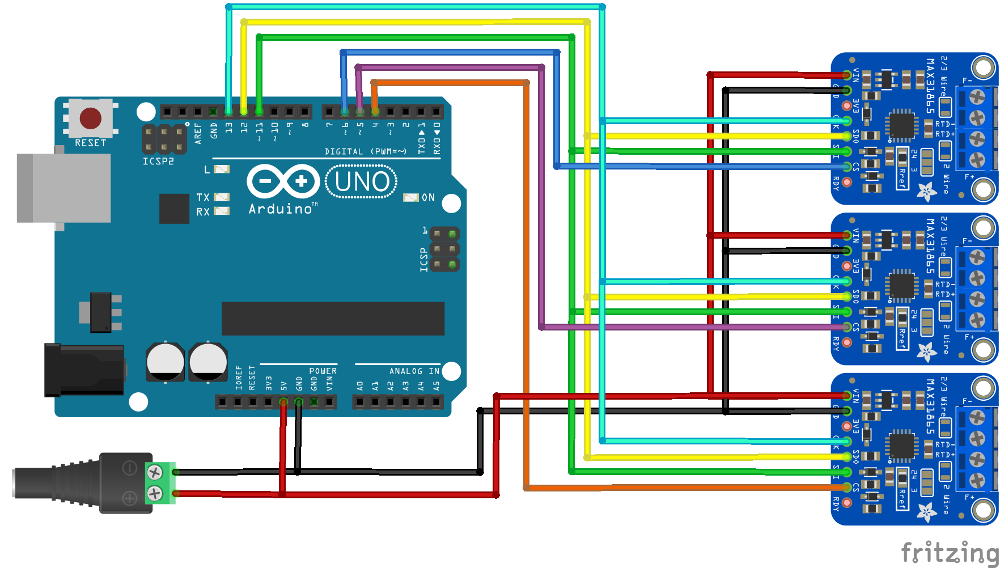

VCC <-> 5V
GND <-> GND
MOSI (SDI) <-> 11
MISO (SDO) <-> 12
SCK (CLK) <-> 13
CS <-> Any available pin

* Available pin (Uno / Nano) = any **digital** or **analog** pin except:
  -  7, 10 (reserved for ethernet RST and CS)
  -  11, 12, 13 (reserved for the SPI bus)
  -  A4, A5 (if you enable I2C sensors, these pins will be reserved for the I2C bus)
  -  A6, A7 (on Nano, these are exclusively analog pins)
* MAX31865 sensors share the SPI bus with the ethernet chip.
* Each sensor is connected to unique CS pin.
* In theory, the number of MAX31865 sensors is limited only by the number of available pins. In practice, you may also be limited  by capacitive loading or reflections on the SPI bus.

## MAX31865 Settings

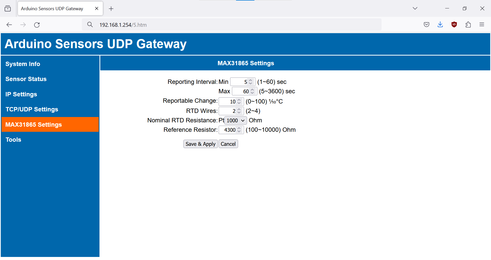

* **Min Reporting Interval**. Minimum interval (in seconds) between two UDP messages with new measurement values. This is the interval at which the gateway polls the MAX31865 sensors. Min Reporting Interval ensures that the sensor is not polled too often and that the UDP message is not sent too often if the temperature flutters between two values.
* **Max Reporting Interval**. Maximum interval (in seconds) between two UDP messages with measurement values. Max Reporting Interval ensures that the UDP message is always sent, even if change to the measurement value is smaller than the Reportable Change.
* **Reportable Change**. Minimum change (in tenths of degrees Celsius) to the measurement value that will result in a UDP message being sent.
* **RTD Wires**. Number of wires for the RTD connection.
* **Nominal RTD Resistance**. Nominal resistance of the RTD at 0°C. Common values are Pt100 and Pt1000.
* **Reference Resistor**. Resistance value of the reference resistor. Check the value of the Rref resistor on the MAX31865 module board. Common values are 430 and 4300 Ohm.

# Integration

UDP communication is connectionless (no handshakes or acknowledgements of delivery) and insecure. However it is reliable enough to use in small, isolated LANs (or VLANs) dedicated for home automation systems. UDP messages generated by this gateway can be easily parsed by Loxone or other systems capable of listening to UDP packets (such as Nore-RED).

## Loxone

In Loxone Config open the UDP Monitor and you will see JSON-formated UDP messages arriving. Example of a UDP message from the MAX31865 sensor (RTD probe):

`{"Sensor":"MAX31865","PinType":"CS","Pin":"6","Value":"22.521","Unit":"\xC2\xB0C","Status":"OK"}`

Create **Virtual UDP Input** (see the [tutorial](https://www.loxone.com/enen/kb/communication-with-udp/)):

* **Sender address**. IP address of your Arduino Sensors UDP Gateway.
* **UDP receive port**. UDP Port of the gateway (default is 10000).

Add **Virtual UDP Input Command** for each sensor, here is an example for the MAX31865 sensor:

* **Command Recognition**. `\i"Pin":"6"\i\i"Value":"\i\v`
I recommend using the search pattern `\iText\i` when parsing JSON-formatted messages (see [this blog post](https://sarnau.info/loxone-udp-http-command-parser-syntax/) for a comprehensive overview of the parser syntax). Since pin is unique for the MAX31865 sensor, we use the `Pin` key-value pair (for DS18x20 1-wire sensors use unique `1WireID`).
* **Use as digital input**. Always disable.

You can also configure validation:
* **Monitor validation**. Enable. You will receive notification in case of an error.
* **Receive timeout**. Set a bit higher than Max Reporting Interval configured on the gateway (see settings for the sensor). If timeout is deteceted by Loxone, you will now that some hard irrecoverable error occured on the sensor or gateway (or on wires inbetween).
* **Value on timeout**. Retain last value.

## Node-RED

Use built-in UDP nodes. Also, it is easy to configure Node-RED for receiving UDP and forwarding the data through another communication protocol to different system.

